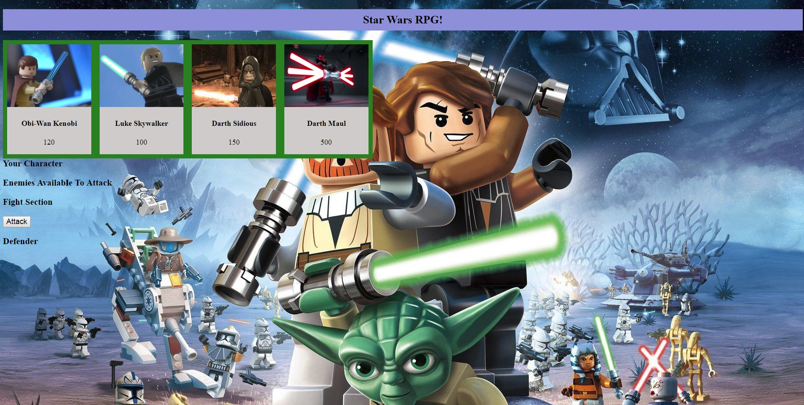

# RPG-Game

## Project Brief
A simple single-player RPG game, where users can choose their character and battle all enemies. 

## Project Walkthrough
* User will have option to chose from 4 characters
* Once chosen a character that becomes the player character and rest 3 characters becomes opponents
* Once chosen an opponenet character, it moves to the fight section
* On click of the Attach button the fight begins and both player & opponent loses health points
* Depending on who reaches 0, the player with gets victory or defeat

## Technologies Used:
Bootstrap, Javascript and Jquery.

[Play the Game](https://shahriar87.github.io/RPG-Game/)

